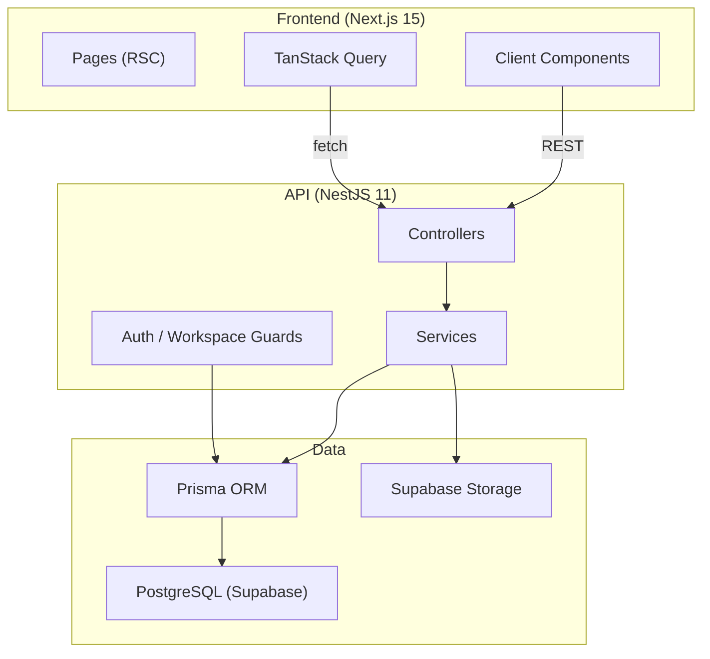
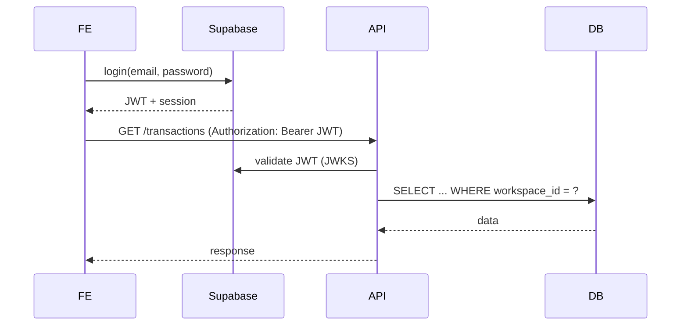

# KoraPay — Documentacion de Arquitectura

## Vision general

KoraPay es una aplicacion full-stack de gestion financiera personal y empresarial. Evoluciona desde Mi Bolsillo, incorporando un modelo multi-tenant con Workspaces, un ledger financiero unificado, y modulos especializados para MIMOTECH y Mimotalents.

## Principios arquitectonicos

1. **Monolito modular**: Un solo deploy de API que contiene todos los modulos de negocio.
2. **Separacion por capas**: Controllers (HTTP), Services (casos de uso), Prisma (persistencia).
3. **Dominio puro**: Logica de negocio sin dependencias de framework en `packages/domain`.
4. **Cliente API generado**: Orval genera el cliente TypeScript desde OpenAPI.
5. **Multi-tenant por Workspace**: Cada entidad pertenece a un workspace; las queries siempre filtran por `workspace_id`.

## Stack

| Capa | Tecnologia |
|------|-----------|
| Frontend | Next.js 15 + React 19 + Tailwind CSS 4 |
| Backend | NestJS 11 + Fastify |
| ORM | Prisma 6 |
| Database | PostgreSQL 16 (Supabase) |
| Auth | Supabase Auth (modo demo en desarrollo) |
| Monorepo | Turborepo + pnpm workspaces |

## Diagrama de Arquitectura



## Flujo de Autenticacion



En modo demo (`DEMO_MODE=true`), el API acepta todas las requests sin validar JWT.

## Estructura del Monorepo

```
korapay/
  apps/
    web/          # Next.js 15 App Router
    api/          # NestJS 11 + Fastify
  packages/
    ui/           # Componentes React reutilizables
    domain/       # Logica pura (enums, money, validacion)
    api-client/   # Cliente generado por Orval
    typescript-config/
  prisma/
    schema.prisma # Modelo de datos
    seed.ts       # Datos demo
  docker/         # Docker compose desarrollo
  docs/           # Documentacion
```
